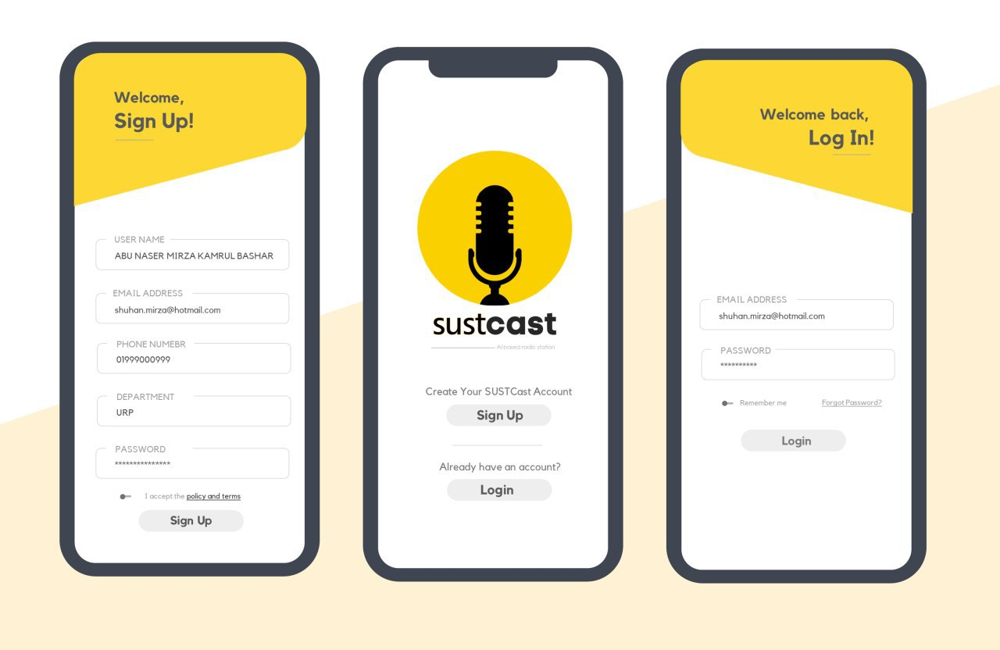

# sustcast-android-app-v1

[](https://forthebadge.com)
[](http://forthebadge.com)
[](https://forthebadge.com)
[](https://forthebadge.com)

# SUSTCast
## Your Pocket-portal to SUST

SUSTCast is an AI-enhanced online radio app built for the SUSTians, by the SUSTians!!<br/>
The fully-automated system is first of it's kind and runs on most low to high-end android phones, seemlessly.<br/>
Currently our features include :
```
 - automated music selections
 - 24/7 radio streaming
 - Broadcasts from BBC news
 - Weekly podcasts from special guests
```
In future versions we will be hosting the live programs of different on-campus cultural organizations.

## System Architecture

* App Front-end follows the MVVM architecture and created with  on 

* For back-end the below tools and frameworks were used :
```
 - FireBase [Authentication, Configuration, Metadata Storage and Server Stats]
 - IceCast2 and Ices2 [Streaming]
 - Docker [For running Ices2]
 - Python [For Scheduling Programs]
 - Sqlite3 [Storing Information Regarding Music]
```
## System Diagram

<p align="center">
  
</p>

## Showcase
<p align="center">
  
</p>
<p align="center">
  
</p>


## Demo
## Future Plans

[](https://play.google.com/store/apps/details?id=com.sust.sustcast)
<br/>
[](https://www.facebook.com/sustcast)


<a href="https://trackgit.com">

</a>
